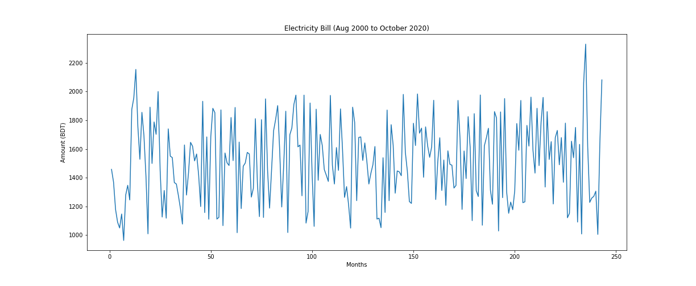
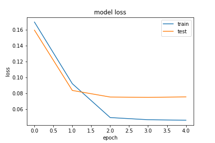
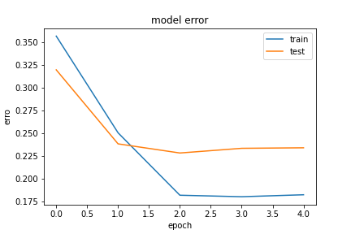

# Electricity_Bill_Prediction_LSTM
Trying to predict the Electricity Bill for Next 4 months. But from the results we can conclude that the data was too much uncertain so that the prediction was too much unstable.
# Dataset 
For Dataset, We take August 2000 to October 2020 electricity bill for our house. Then apply Techear forcing techniques.

# Architecture

# Training Loss and Error

# Result

